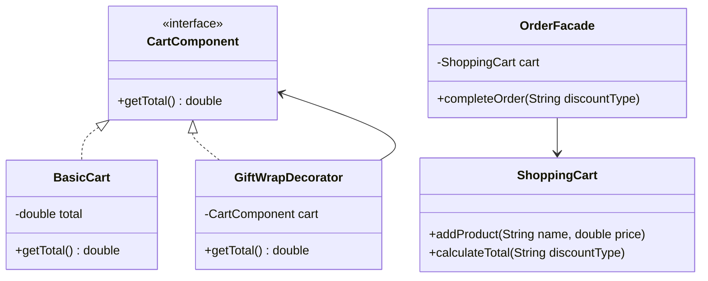

```mermaid
classDiagram

class CartComponent {
    <<interface>>
    +getTotal() double
}

class BasicCart {
    -double total
    +getTotal() double
}

class GiftWrapDecorator {
    -CartComponent cart
    +getTotal() double
}

class OrderFacade {
    -ShoppingCart cart
    +completeOrder(String discountType)
}

class ShoppingCart {
    +addProduct(String name, double price)
    +calculateTotal(String discountType)
}

CartComponent <|.. BasicCart
CartComponent <|.. GiftWrapDecorator
GiftWrapDecorator --> CartComponent
OrderFacade --> ShoppingCart
```